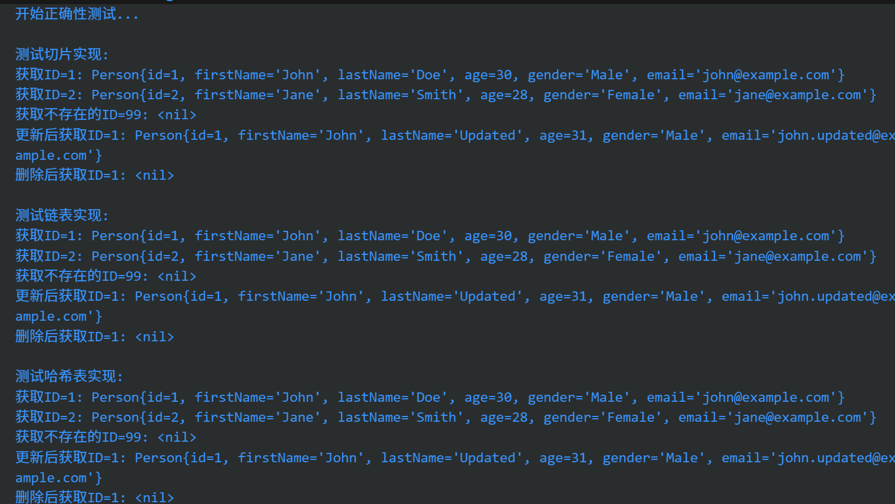
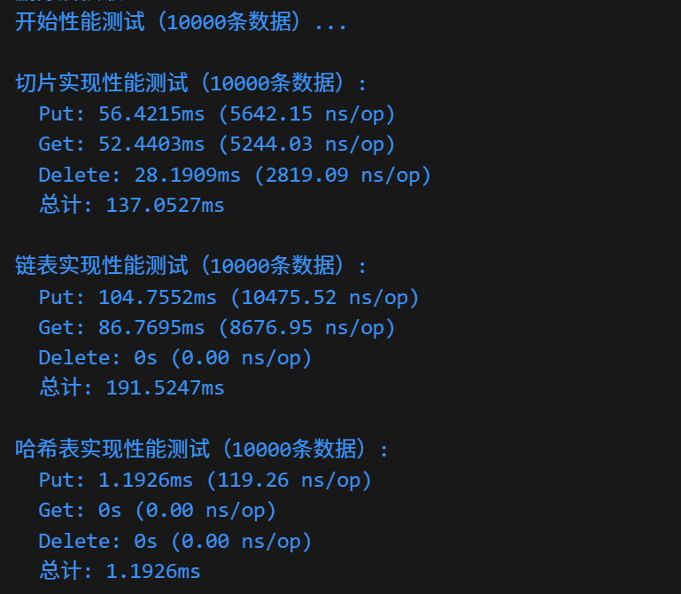

# EchoDB

一个高性能的Go语言Map实现项目，支持多种数据结构实现。

## 项目结构

```
EchoDB/
├── cmd/                    # 主程序入口
│   └── main.go
├── models/                 # 数据模型
│   └── person.go
├── interfaces/             # 接口定义、实现和测试
│   └── map.go
├── go.mod                  # Go模块文件
└── README.md              # 项目说明
```

## 功能特性

- **多种实现**: 支持切片、链表、哈希表三种Map实现
- **统一接口**: 所有实现都遵循相同的接口规范
- **性能测试**: 内置性能基准测试
- **正确性测试**: 完整的功能测试

## 接口定义

```go
type MyMap interface {
    Put(id int, person *Person)
    Get(id int) *Person
    Delete(id int)
}
```

## 实现对比

| 实现方式   | 时间复杂度 | 空间复杂度 | 适用场景                 |
| ---------- | ---------- | ---------- | ------------------------ |
| 切片实现   | O(n)       | O(n)       | 小数据量，简单场景       |
| 链表实现   | O(n)       | O(n)       | 中等数据量，需要顺序访问 |
| 哈希表实现 | O(1)       | O(n)       | 大数据量，高性能要求     |

## 测试

* 正确性测试

  
* 性能测试

  
